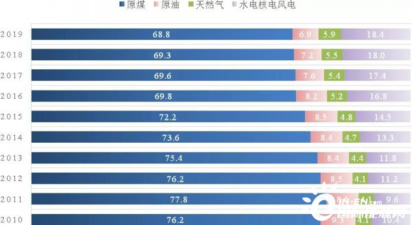
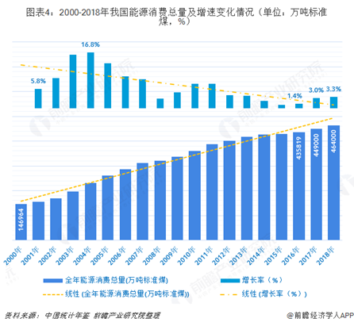
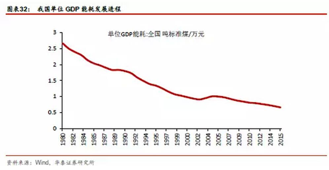
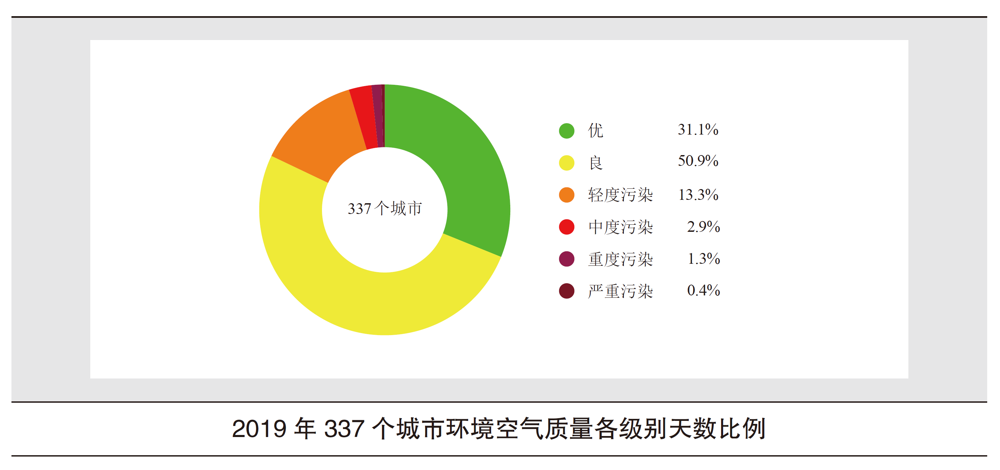
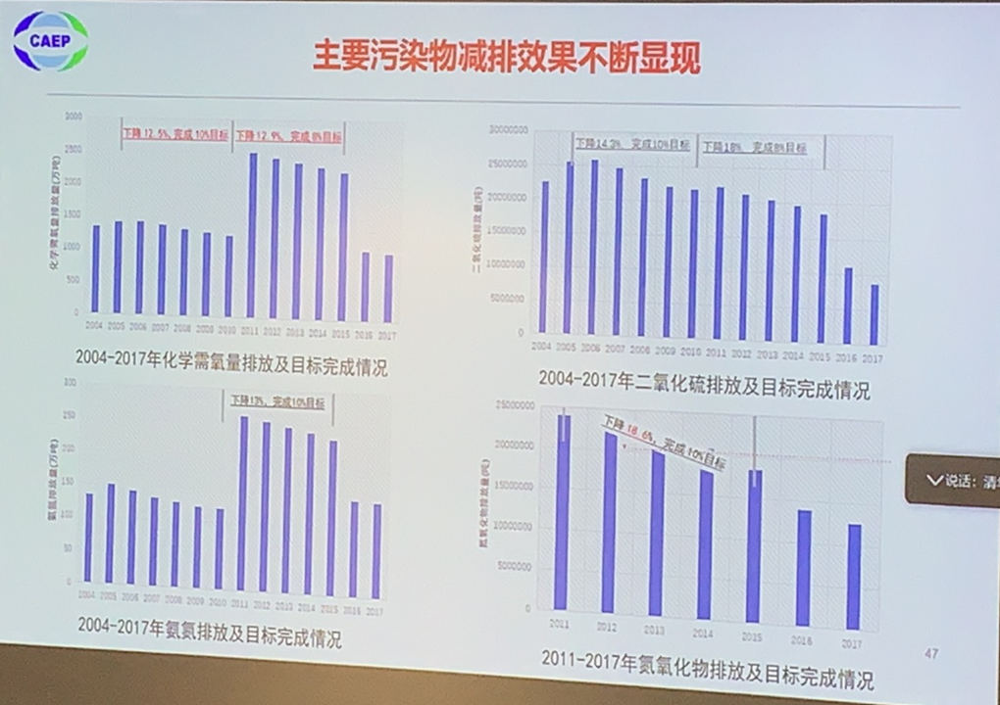
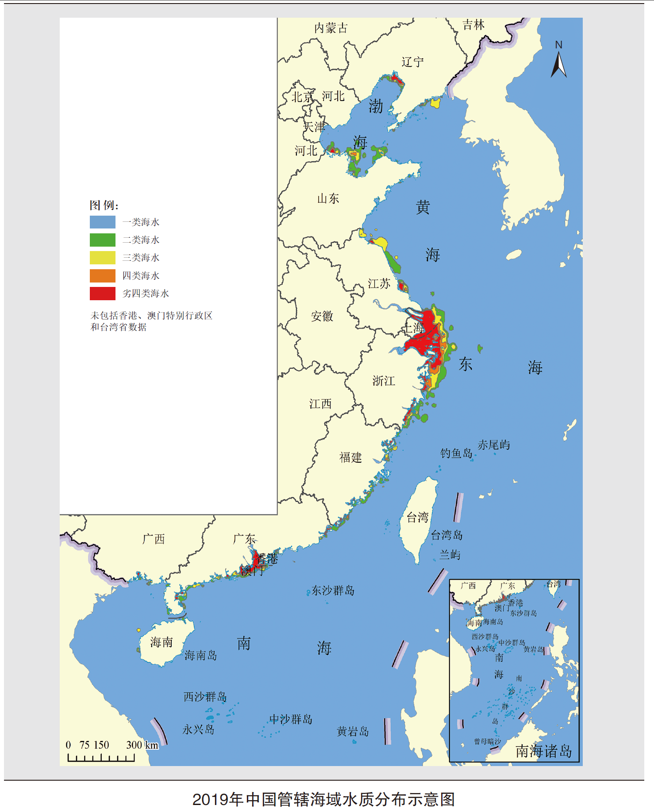
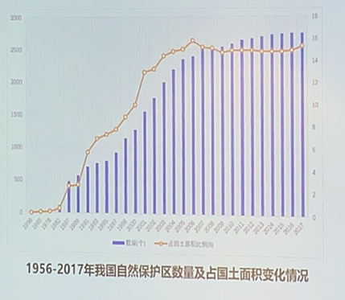
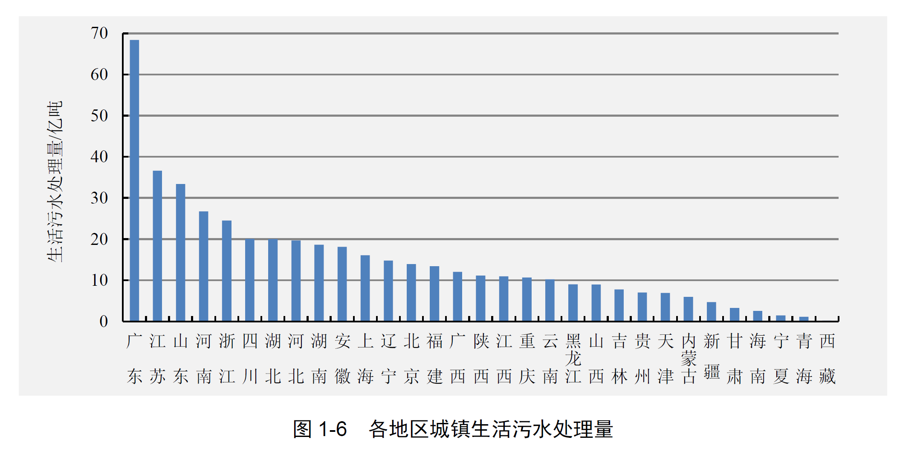
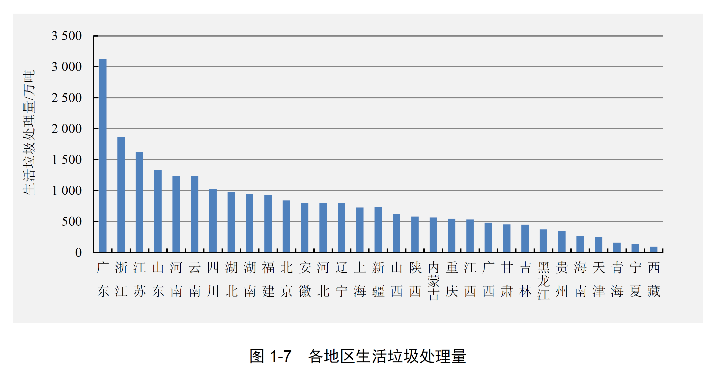

# ChineseSocialism环境调研
中特课程报告——环境保护方向调研着重生活垃圾处理

## 参考文献

1. 中华人民共和国生态环境部2019中国生态环境状况公报
2. 中华人民共和国生态环境部2015年环境统计年报
3. 新华网引人民日报文章“减碳，中国设定硬指标”http://www.xinhuanet.com/fortune/2020-09/30/c_1126560454.htm

二氧化碳排放力争于2030年前达到峰值，努力争取2060年前实现碳中和

http://www.xinhuanet.com/fortune/2020-09/30/c_1126560454.htm

这个是个热点，直接影响环保产业，间接影响能源系统

http://www.mee.gov.cn/hjzl/

中华人民共和国生态环境部

## 战略政策成效

在一系列政策的推进和法律的监管下，我国在以下几个方面有较为明显的成果：

### 推动经济高质量发展

煤炭占我国能源消费总量比重始终第一，但是总体呈现下降趋势，由1953年的94.4%下降到2018年的68.8%。

能效水平显著提高 单位GDP能耗不断下降：

初步核算，2019年能源消费总量48.6亿吨标准煤，比2018年增长3.3%，煤炭消费量增长1.0%，原油消费量增长6.8%，天然气消费量增长8.6%，电力消费量增长4.5%。煤炭消费量占能源消费总量的57.7%，比2018年下降1.5个百分点；天然气、水电、核电、风电等清洁能源消费量占能源消费总量的23.4%，比2018年上升1.3个百分点。万元国内生产总值能耗比2018年下降2.6%。

工业废气  2018年，全国环境统计重点调查的112559家涉气企业中，88585家安装废气治理设施。全国废气治理设施368999套，比2017年增加6.9%。其中，脱硫设施41746套，平均脱硫效率95.3%；脱硝设施21816套，平均脱硝效率79.1%；除尘设施130019套，平均除尘效率99.5%。

工业废水  2018年，全国环境统计重点调查的71323家涉水企业中，59708家安装废水治理设施。全国废水治理设施72952套，比2017年增加3.7%。废水治理设施处理能力22370万吨/日。

污水  截至2019年底，全国城市污水处理厂处理能力1.77亿立方米/日，累计处理污水量532亿立方米；全国地级及以上城市建成区排查出黑臭水体2899个，其中2513个经过处理已消除黑臭现象，消除比例达86.7%。

垃圾  截至2019年底，全国城市生活垃圾无害化处理能力87.08万吨/日，无害化处理率99.2%；全国排查出的2.4万个非正规垃圾堆放点中，90%以上已完成整治任务。

### 改善提升环境质量

#### 空气

《中国空气质量改善报告（2013-2018年）》指出，2013—2018年短短6年时间，在保持经济平稳快速发展的同时，中国环境空气质量总体改善，重点区域明显好转。
2013以来，中国经济持续增长、能源消费量持续增加，2018年全国GDP相比2013年增长39%，能源消费量和民用汽车保有量分别增长11%和83%，多项大气污染物浓度实现了大幅下降，全国环境空气质量总体改善。

2019 年，全国337 个地级及以上城市中，157 个城市环境空气质量达标，占全部城市数的46.6%。337 个城市平均优良天数比例为82.0%， 其中，16 个城市优良100%、199 个城市优良天数比例在 80% ～ 100%之间、106 个城市优良天数比例在 50% ～ 80%之间、16 个城市优良天数比例低于 50%；平均超标天数比例为 18.0%， 以 PM2.5、O3、 PM10、NO2 和 CO 为首要污染物的超标天数分别占总超标天数的 45.0%、41.7%、12.8%、0.7%天数比例为和不足 0.1%，未出现以 SO2 为首要污染物的超标。337 个城市累计发生严重污染 452 天，比 2018 年减少 183 天；重度污染 1666 天，比2018 年增加 88 天。以 PM2.5、PM10 和O3 为首要污染物的天数分别占重度及以上污染天数的78.8%、19.8% 和 2.0%，未出现以 SO2、NO2 和CO 为首要污染物的重度及以上污染。

秸秆焚烧：2019 年，卫星遥感共监测到全国秸秆焚烧火点 6300 个（不包括云覆盖下的火点信息），主要分布在黑龙江、内蒙古、吉林、河北、山西、辽宁、安徽、山东、湖北、河南等省（区）。火点个数比 2018 年减少 1347 个。

酸雨分布：2019 年，酸雨区面积约 47.4 万平方千米，占国土面积的 5.0%，比 2018 年下降 0.5 个百分点，其中较重酸雨区面积占国土面积的 0.7%。酸雨主要分布在长江以南—云贵高原以东地区，主要包括浙江、上海的大部分地区、福建北部、江西中部、湖南中东部、广东中部和重庆南部。

酸雨频率：469 个监测降水的城市（区、县）酸雨频率平均为 10.2%，比 2018 年下降 0.3个百分点。出现酸雨的城市比例为 33.3%，比2018 年下降 4.3 个百分点；酸雨频率在 25% 及以上、50% 及以上和 75% 及以上的城市比例分别为 15.4%、8.3% 和 2.6%。

降水酸度：全国降水 pH 年均值范围为 4.22 （江西吉安市）～ 8.56（新疆库尔勒市），平均为 5.58。酸雨、较重酸雨和重酸雨城市比例分别为 16.8%、4.5% 和 0.4%。

#### 淡水

全国地表水：2019年，全国地表水监测的1931个水质断面（点位）中，Ⅰ～Ⅲ类水质断面（点位）占74.9%，比2018年上升3.9个百分点；劣Ⅴ类占3.4%，比2018年下降3.3个百分点**。主要污染指标为化学需氧量、总磷和高锰酸盐指数。

河流：2019年，长江、黄河、珠江、松花江、淮河、海河、辽河七大流域和浙闽片河流、西北诸河、西南诸河监测的1610个水质断面中， Ⅰ～Ⅲ类水质断面占79.1%，比2018年上升4.8个百分点；劣Ⅴ类占3.0%，比2018年下降3.9个百分点。主要污染指标为化学需氧量、高锰酸盐指数和氨氮。西北诸河、浙闽片河流、西南诸河和长江流域水质为优，珠江流域水质良好，黄河流域、松花江流域、淮河流域、辽河流域和海河流域为轻度污染。

#### 海洋

2 0 1 9年，一类水质海域面积占管辖海域面积的97.0%，比2018年上升0.7个百分点；劣四类水质海域面积为283 40平方千米，比2018年减少4930平方千米。主要污染指标为无机氮和活性磷酸盐。

### 提高生态系统稳定性

2019年，全国生态环境状况指数（EI）值为51.3，生态质量一般，与2018年相比无明显变化。生态质量优和良的县域面积占国土面积的44.7%，主要分布在青藏高原以东、秦岭—淮河以南、东北的大小兴安岭地区和长白山地区；一般的县域面积占22.7%，主要分布在华北平原、黄淮海平原、东北平原中西部和内蒙古中部；较差和差的县域面积占32.6%，主要分布在内蒙古西部、甘肃中西部、西藏西部和新疆大部。817个开展生态环境动态变化评价的国家重点生态功能区县域中，与2017年相比，2019年生态环境变好的县域占12.5%，基本稳定的占78.0%，变差的占9.5%。

生态系统多样性  中国具有地球陆地生态系统的各种类型，其中森林212类、竹林36类、灌丛113类、草甸77类、草原55类、荒漠52类、自然湿地30类；有红树林、珊瑚礁、海草床、海岛、海湾、河口和上升流等多种类型的海洋生态系统；有农田、人工林、人工湿地、人工草地和城市等人工生态系统。

物种多样性  中国已知物种及种下单元数106509种。其中，动物界49044种，植物界44510种，细菌界469种，色素界2375种，真菌界7386种，原生动物界1920种，病毒805种。列入国家重点保护野生动物名录的珍稀濒危陆生野生动物406种，大熊猫、金丝猴、藏羚羊、褐马鸡、扬子鳄等数百种动物为中国所特有。列入国家重点保护野生植物名录的珍贵濒危植物8类246种，已查明大型真菌种类9302种。

遗传资源多样性  中国有栽培作物528类1339个栽培种，经济树种达1000种以上，原产观赏植物种类达7000种，家养动物576个品种。

## 改革重点方向

在一系列政策规划和目标中，我们可以看出未来中国环境改革的重点方向。

习近平主席在第七十五届联合国大会一般性辩论上指出，中国将提高国家自主贡献力度，采取更加有力的政策和措施，二氧化碳排放力争于2030年前达到峰值，努力争取2060年前实现碳中和。“二氧化碳排放力争于2030年前达到峰值，努力争取2060年前实现碳中和。”是今年习总书记提出的，光是节能减排这一部分就涉及到很多方面。

在众多中国环境改革的重点方向中，产业结构调整、二氧化碳减排、生活垃圾精细化处理具有代表性。

### 结构调整

倒逼结构调整，促高质量发展与生态环境质量提升：

“力争在2030年前达到峰值，体现了中国主动为应对全球气候变化多做贡献的担当，树立了负责任大国形象。”中国国家气候变化专家委员会副主任何建坤表示，面对气候变化这一非传统领域的安全威胁，以全球合作推进治理进程，已经成为国际共识。中国率先控制住新冠肺炎疫情，在这个节点提出新的二氧化碳减排目标，就是向世界明确，中国要走绿色复苏、绿色转型的道路。

生态环境部应对气候变化司司长李高认为，国家减排新目标为推动国内经济高质量发展和生态文明建设提供了有力抓手。不能只将达峰目标看作是减少二氧化碳排放，实际上，这个目标是我国高质量发展、经济社会全面进步的重大推动力。

“实现达峰乃至碳中和的目标，二氧化碳排放必须大幅下降，这将有力倒逼能源结构、产业结构不断调整优化，带动绿色产业强劲增长。”李高说，从污染治理角度看，以大气污染治理为例，我们现有的大多数手段还停留在末端治理，调结构是污染治理的治本之策，明确二氧化碳达峰目标，以更多手段促进结构调整，将产生巨大的减排协同效应，有效促进生态环境质量提升。

### 二氧化碳减排

“十四五”规划中，二氧化碳减排将有硬措施

“国家实力进一步增强，政策创新能力显著提升，改革带来的红利、对制度的自信，都让我们对国家减排新目标的实现充满信心。但是减碳一定是一场攻坚战，需要久久为功。”李高表示。

“从达峰到中和，发达国家过渡期有60—70年的时间，而中国只有30年时间，能源和经济转型、二氧化碳和其他温室气体减排的速度和力度都要比发达国家大得多。”何建坤认为，实现目标的路径有4个方面，涵盖加大产业结构转型的强度和力度，以数字化来推进低碳化；充分节约资源，发展循环经济；做好能源替代，建设近零排放的能源体系；在农业、林业、草原、湿地等系统寻求基于自然的解决方案，确保实现每年吸收8亿吨二氧化碳等。

### 继续宣传垃圾分类

根据中华人民共和国生态环境部2015年《生态环境统计年报》，集中式污染治理设施最新的数据是：

2015 年，全国共调查统计 6 910 座城镇污水处理厂，比 2014 年增加 879 座；设计处理能力为 18 736 万吨/日，比 2014 年新增 1 008 万吨/日；年运行费用为 477 亿元，比2014 年增加 37 亿元。全年共处理废水 532.3 亿吨，比 2014 年增加 38.0 亿吨，其中，处理生活污水 470.6 亿吨，占总处理水量的 88.4%。共去除化学需氧量 1 262.4 万吨，氨氮122.7 万吨，油类6.9 万吨，总氮 138.5 万吨，总磷 15.2 万吨。污水处理厂的污泥产生量为 3 015.9 万吨，污泥处置量为 3 015.8 万吨。 

2015 年，全国共调查统计了生活垃圾处理厂（场）2 315 座，比 2014 年增加 38 座；填埋设计容量达到370 331 万米3；堆肥设计处理能力达到 1.46 万吨/日；焚烧设计处理能力达到19.1 万吨/日；年运行费用为 159.8 亿元。全年共处理生活垃圾 2.48 亿吨，其中采用填埋方式处置的生活垃圾 1.78 亿吨，采用堆肥方式处置 0.04 亿吨，采用焚烧方式处置0.66 亿吨。 

可以看出，大量的生活垃圾直接填埋，回收再利用的很少，需要大力推行垃圾分类，以减少填埋量。

当然北京出台了垃圾分类新规，2020北京市生活垃圾管理条例5月1日起施行，但是仍需进一步加强人们垃圾分类的意识。