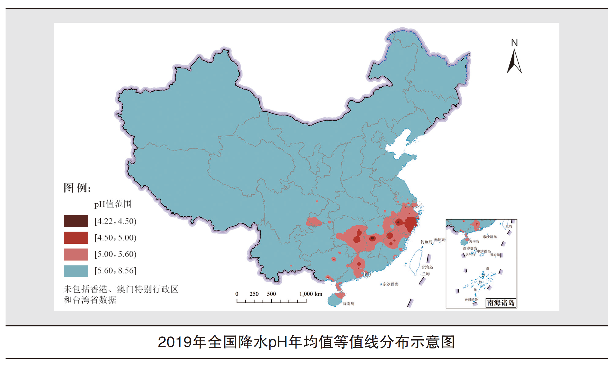

# ChineseSocialism环境调研
中特课程报告——环境保护方向调研着重生活垃圾处理

大概就是写一下新时期的改革方向，就是类似这个PDF第三部分，但是可以按照他PPT的大标题拆成两个部分，但是总体还是围绕着历史发展的时间纬度来写的，就是侧重新时期的发展

战略政策成效&改革重点方向

## 战略政策成效

在一系列政策的推进和法律的监管下，我国在以下几个方面有较为明显的成果：

### 推动经济高质量发展

煤炭占我国能源消费总量比重始终第一，但是总体呈现下降趋势，由1953年的94.4%下降到2018年的68.8%。

随着我国能源总量不断发展壮大、用能方式加快变革，能源结构持续大幅优化改善，清洁低碳化进程不断加快。同时能效水平显著提高 单位GDP能耗不断下降，消费结构持续优化改善，生产结构也逐步向清洁化转变。

随着我国能源科技创新能力不断提升，能源技术装备突飞猛进发展，自动化、智能化、数字化推动能源系统不断优化，能效水平得到显著提升。从单位GDP能耗降低率来看，在改革开放之前波动较大，多数年份为上升，改革开放之后基本保持下降态势。

### 改善提升环境质量

#### 空气

《中国空气质量改善报告（2013-2018年）》指出，2013—2018年短短6年时间，在保持经济平稳快速发展的同时，中国环境空气质量总体改善，重点区域明显好转。
2013以来，中国经济持续增长、能源消费量持续增加，2018年全国GDP相比2013年增长39%，能源消费量和民用汽车保有量分别增长11%和83%，多项大气污染物浓度实现了大幅下降，全国环境空气质量总体改善。

2019 年，全国337 个地级及以上城市中，157 个城市环境空气质量达标。

#### 淡水

全国地表水：2019年，全国地表水监测的1931个水质断面（点位）中，Ⅰ～Ⅲ类水质断面（点位）占74.9%，比2018年上升3.9个百分点；劣Ⅴ类占3.4%，比2018年下降3.3个百分点**。主要污染指标为化学需氧量、总磷和高锰酸盐指数。

河流：2019年，长江、黄河、珠江、松花江、淮河、海河、辽河七大流域和浙闽片河流、西北诸河、西南诸河监测的1610个水质断面中， Ⅰ～Ⅲ类水质断面占79.1%，比2018年上升4.8个百分点；劣Ⅴ类占3.0%，比2018年下降3.9个百分点。主要污染指标为化学需氧量、高锰酸盐指数和氨氮。西北诸河、浙闽片河流、西南诸河和长江流域水质为优，珠江流域水质良好，黄河流域、松花江流域、淮河流域、辽河流域和海河流域为轻度污染。

#### 海洋

2 0 1 9年，一类水质海域面积占管辖海域面积的97.0%，比2018年上升0.7个百分点。

### 生态系统稳定性提高

2019年，全国生态环境状况指数（EI）值为51.3，说明生态系统多样性 、物种多样性、遗传资源多样性保护较好。

## 改革重点方向

总的来说，我国目前为止的环境保护政策改革分为以下几个方面：在环境战略理念方面，目前我国已经由“先污染后治理、边污染边治理、经济发展优先环境保护”向“保护环境与经济增长并重、协同推进经济高质量发展与生态环境高水平保护、绿水青山就是金山银山”转变；在政策方面，正在从总量为主向质量核心、兼顾总量、防范风险转变，从行政区域为主到强化区域流域综合调控转变，从全面平推向突出重点、差异化施策转变，从小环保到管生产、管发展、管行业的必须管环保的大环保格局转变，从行政执法向执法、司法、社会信用、经济手段综合运用转变，着力构建党委负责、政府主导、企业主体、社会组织和公众共治的环境治理体系。

习近平主席在第七十五届联合国大会上提出：“二氧化碳排放力争于2030年前达到峰值，努力争取2060年前实现碳中和。”的目标，可以看出未来中国环境改革的重点方向之一是中国将提高国家自主贡献力度，采取更加有力的政策和措施，二氧化碳排放力争于2030年前达到峰值，努力争取2060年前实现碳中和。

而生态环境保护政策改革的目标是实现环境治理体系现代化和环境治理能力现代化，我国目前的环境保护政策较为完善，但新时代我国环境保护政策需要应对新的挑战，仍需进一步改进：

### 生态环境管理体制改革

中共中央、国务院印发了《生态文明体制改革总体方案》，指出绿水青山就是金山银山，清新空气、清洁水源、美丽山川、肥沃土地、生物多样性是人类生存必需的生态环境，坚持发展是第一要务，必须保护森林、草原、河流、湖泊、湿地、海洋等自然生态。把握人口、经济、资源环境的平衡点推动发展，人口规模、产业结构、增长速度不能超出当地水土资源承载能力和环境容量。

山水林田湖是一个生命共同体，我们需要按照生态系统的整体性、系统性及其内在规律，统筹考虑自然生态各要素、山上山下、地上地下、陆地海洋以及流域上下游，进行整体保护、系统修复、综合治理，增强生态系统循环能力，维护生态平衡。

### 构建生态文明和环境保护法治体系

2018年5月，习近平总书记在全国生态环境保护大会上提出：“要加快构建生态文明体系，加快建立健全以生态价值观念为准则的生态文化体系，以产业生态化和生态产业化为主体的生态经济体系，以改善生态环境质量为核心的目标责任体系，以治理体系和治理能力现代化为保障的生态文明制度体系，以生态系统良性循环和环境风险有效防控为重点的生态安全体系。”

要培养人们牢固树立人与自然和谐共生的意识，坚持尊重自然、顺应自然、保护自然的理念和要像对待生命一样对待生态环境，培养热爱自然、珍爱生命的生态伦理意识。

从内容上来说，要大力发展生态文化，开展宣传教育活动，并引导公众参与和行动。

同时还要建立健全责任体系、完善评价考核体系、建立责任追究制度。

要坚持依法依规、客观公正、科学认定、权责一致、终身追究的原则，对那些不顾生态环境盲目决策、造成严重后果的人，必须追究其责任，而且应该终身追究。

### 建立生态环境空间管控制度

空间资源的优化配置和守牢底线是一项新的挑战，要实施好空间的生态环境属性差异化管控，需要进一步健全生态环境空间管控政策体系：

（以下内容节选自《国家“十四五”生态环境政策改革重点与创新路径研究》）

一是实施水气土环境要素质量分区管控政策。继续推进优化实施以控制单元为基础的水环境质量目标管理，将流域生态环境保护责任层层分解到各级行政区域，全面建立完善流域水环境质量责任管理体系；重点区域实行大气环境分区管控，强化行政处罚、环保督察、经济政策等组合调控；完善建设用地准入清单政策和农用地分类管理政策，重点制定受污染耕地安全利用和综合防控政策，制定重点区域、重点行业、典型地块污染风险防控政策。

二是建立重要生态空间分区管控政策。以生态保护红线和自然保护地为重点，合理分区实行差别化管控要求，建立健全生态补偿长效机制和多渠道生态建设资金投入机制；加强海洋保护区、海洋生态保护红线区、海洋生态修复工程实施区“三类区域”分类管控，积极制定海洋生态补偿、损害赔偿、海洋垃圾清理等政策，建立激励与约束并重的政策体系。

三是推进“三线一单”为基础的生态环境空间管控政策。将污染源普查、环境调查、环境监测、排放清单、排污许可、执法审批数据与“三线一单”和功能区划成果融合，形成“三线一单”数据标准、技术规范、配套规整和管理政策。

四是加快完善生态环境空间管控配套政策。综合生态环境各要素管控分区及重点资源利用管控分区，建立区域生态环境空间评价制度和生态环境管控清单准入制；建立生态环境空间监测考评机制，基于分区构建“纵横联合”的生态环境监管管理体系，建立不同类型生态环境空间监督与绩效考核评价体系。

### 完善生态环境市场经济机制

《中共中央关于制定国民经济和社会发展第十四个五年规划和二〇三五年远景目标的建议》对“十四五”时期的生态环境保护提出了明确的目标：生态环境保护投资是“十四五”期间优化投资结构、扩大战略性新兴产业投资的重点领域，也是建立政府投资引导、激发民间投资活力、形成市场为主导的投资内生增长机制的急需领域。

健全自然资源资产产权制度和法律法规，加强自然资源调查评价监测和确权登记，建立生态产品价值实现机制，完善市场化、多元化生态补偿，推进资源总量管理、科学配置、全面节约、循环利用。实施国家节水行动，建立水资源刚性约束制度。提高海洋资源、矿产资源开发保护水平。完善资源价格形成机制。推行垃圾分类和减量化、资源化。加快构建废旧物资循环利用体系。

另外还需倒逼结构调整，促高质量发展与生态环境质量提升。

### 建设公众广泛参与的社会治理体系

党的十九大提出到本世纪中叶建成美丽中国的宏伟目标。构建政府为主导、企业为主体、社会组织和公众共同参与的环境治理体系，2018年全国生态环境保护大会提出“把建设美丽中国转化为全体人民自觉行动”。

每个人都是生态环境的保护者、建设者、受益者，没有哪个人是旁观者、局外人、批评家，谁也不能只说不做、置身事外。

良好的城市生态环境需要全社会的共同努力，尤其离不开社会公众的有效参与，公众参与成为今后城市生态环境治理的必然出路和选择。

要进一步提高公众的参与度，包括继续宣传垃圾分类等：

如图：

大量的生活垃圾直接填埋，回收再利用的很少，需要大力推行垃圾分类，以减少填埋量。当然北京出台了垃圾分类新规，2020北京市生活垃圾管理条例5月1日起施行，但是仍需进一步加强人们垃圾分类的意识。

同时需要宣传节约用水以减少污水使用量。

### 夯实绩效评估和责任机制

继中共中央办公厅、国务院办公厅印发《关于划定并严守生态保护红线的若干意见》《关于在国土空间规定中统筹划定三条控制线的指导意见》，加强生态保护红线监管，2020年11月生态环境部也制定印发了《生态保护红线监管指标体系（试行）》，旨在建设和完善生态保护红线综合监测网络体系，开展定期评价，建立考核机制，对各省（区、市）党委和政府开展生态保护红线保护成效考核。

习近平总书记指出：“在生态保护红线方面，要建立严格的管控体系，实现一条红线管控重要生态空间，确保生态功能不降低、面积不减少、性质不改变。”

生态保护红线监管指标需要可获取、可量化、可评估，提高指标数据质量，客观反映生态保护红线状态及变化，确保监管成果具有真实权威性。

## 参考文献

1. 中华人民共和国生态环境部2019中国生态环境状况公报
2. 中华人民共和国生态环境部2015年环境统计年报
3. 新华网引人民日报文章“减碳，中国设定硬指标”http://www.xinhuanet.com/fortune/2020-09/30/c_1126560454.htm
4. 国家统计局 新中国成立70周年经济社会发展成就系列报告 http://www.stats.gov.cn/tjsj/zxfb/201907/t20190718_1677011.html
5. 王金南：中国环境保护战略政策70年历史变迁与改革方向 http://huanbao.bjx.com.cn/news/20191004/1011021.shtml
6. 中国环境战略与政策发展进程、特点及展望 https://theory.gmw.cn/2019-11/29/content_33359927.htm
7. 《中办国办印发〈指导意见〉 构建现代环境治理体系》，《人民日报》2020年3月4日。

## OTHERS REF

二氧化碳排放力争于2030年前达到峰值，努力争取2060年前实现碳中和

http://www.xinhuanet.com/fortune/2020-09/30/c_1126560454.htm

这个是个热点，直接影响环保产业，间接影响能源系统

http://www.mee.gov.cn/hjzl/

中华人民共和国生态环境部

